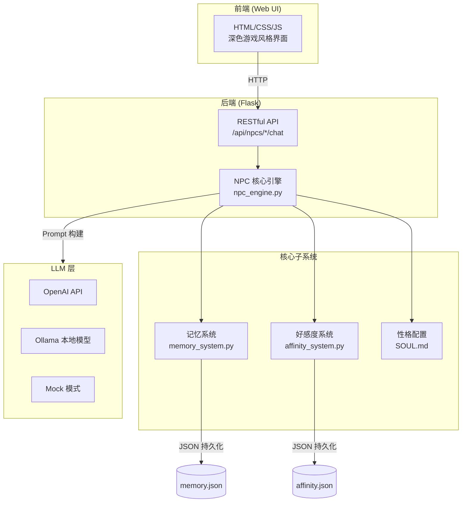
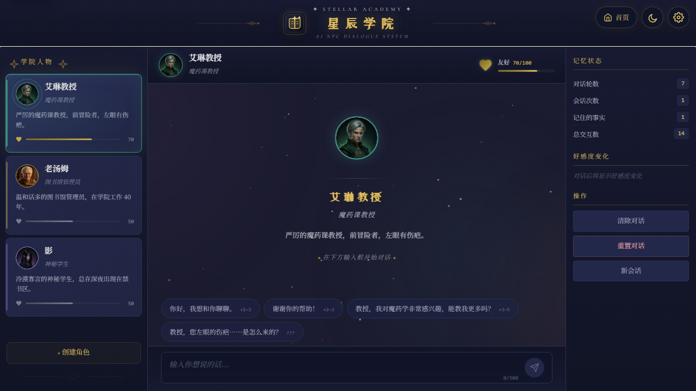
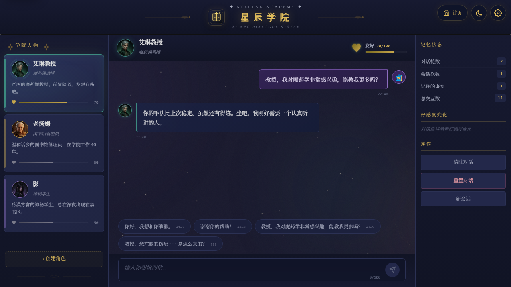
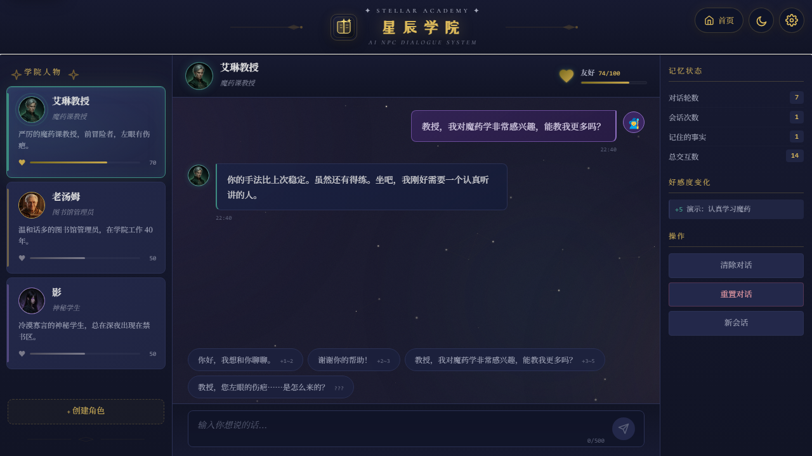

# 星辰学院 - AI NPC 对话系统

> 一个基于 LLM 的智能 NPC 对话系统，实现了具有记忆、好感度和独立性格的游戏角色交互。


## 项目简介

**星辰学院**是一个 AI NPC 对话系统 Demo，展示了如何将大语言模型（LLM）应用于游戏 NPC 对话生成。系统包含 3 个具有完整性格设定的 NPC 角色，每个角色都能：

- 根据 SOUL.md 配置文件保持一致的角色性格
- 记住与玩家的历史对话内容（记忆系统）
- 根据玩家行为动态调整好感度（好感度系统）
- 在不同好感度下展现不同的对话态度和内容

## 技术架构



## 快速开始

### 环境要求

- Python 3.10+
- pip

### 安装和运行

```bash
# 1. 克隆项目
git clone https://github.com/yanglei070-ux/ai-npc-dialogue-system.git
cd ai-npc-dialogue-system

# 2. 安装依赖
pip install -r requirements.txt

# 3. 配置 LLM（三选一）

# 方式 A：使用 OpenAI API（推荐）
export OPENAI_API_KEY="your-api-key"
# 或修改 config.yaml 中的 api_key

# 方式 B：使用 Ollama 本地模型
# 先安装 Ollama: https://ollama.com
ollama pull qwen2.5:7b
# 然后修改 config.yaml 中 provider 为 "ollama"

# 方式 C：Mock 模式（无需 API，用于测试 UI）
# 修改 config.yaml 中 provider 为 "mock"

# 4. 启动服务
python src/app.py

# 5. 打开浏览器访问
# http://127.0.0.1:5001
```

### Docker 部署（可选）

```bash
# 构建并运行
docker build -t star-academy-npc .
docker run -p 5001:5001 -e OPENAI_API_KEY=your-key star-academy-npc
```

## 游戏截图

| 主界面 | 与艾琳教授对话 | 好感度系统 |
|:---:|:---:|:---:|
|  |  |  |

## NPC 角色介绍

### 🧪 魔药课教授 · 艾琳

| 属性 | 描述 |
|------|------|
| **全名** | 艾琳·暮光 (Eileen Twilight) |
| **身份** | 星辰学院魔药课教授 |
| **性格** | 严厉、务实、言简意赅 |
| **口头禅** | 「别废话，动手做。」 |
| **背景** | 前冒险者，左眼有伤疤，桌上永远放着一杯冷掉的红茶 |

**好感度变化特征：**
- 低好感：冰冷拒绝 → 高好感：外冷内热，偷偷关心学生
- 极高好感解锁：分享冒险故事和伤疤来历，教授秘药配方

### 📚 图书馆管理员 · 老汤姆

| 属性 | 描述 |
|------|------|
| **全名** | 汤姆·书影 (Tom Bookshadow) |
| **身份** | 大图书馆管理员 |
| **性格** | 温和、博学、爱唠叨 |
| **口头禅** | 「啊，说到这个我想起来……」 |
| **背景** | 在学院工作 40 年，读遍了每一本书（包括会咬人的书） |

**好感度变化特征：**
- 低好感：简短服务 → 高好感：分享学院秘闻
- 特殊能力：根据玩家问题推荐相关书籍（知识库检索）
- 极高好感解锁：揭示学院终极秘密和「影」的身份线索

### 🌙 神秘学生 · 影

| 属性 | 描述 |
|------|------|
| **全名** | ??? (真名被隐藏) |
| **身份** | 表面是低年级学生，实际是被诅咒的高年级学生 |
| **性格** | 冷漠、防备、傲娇 |
| **口头禅** | 「……随便你。」 |
| **背景** | 身份成谜，总在深夜出现在禁书区，试图解除身上的诅咒 |

**好感度变化特征：**
- 低好感：只有一两个字的回应 → 高好感：话变多，展现傲娇本质
- 极高好感解锁：揭示真实身份「莱拉·星落」和诅咒的全部秘密

## 核心系统说明

### 记忆系统 (Memory System)

```
┌─────────────────────────────────────────┐
│           记忆系统架构                    │
├─────────────────────────────────────────┤
│                                         │
│  对话历史 (最近10轮)                     │
│  ┌─────────────────────────────────┐    │
│  │ Player: "我叫小明"               │    │
│  │ NPC: "小明？记住了。"             │    │
│  │ Player: "我想学魔药学"           │    │
│  │ NPC: "你倒是有眼光。"             │    │
│  └─────────────────────────────────┘    │
│                                         │
│  玩家事实库 (自动提取)                   │
│  ┌─────────────────────────────────┐    │
│  │ • 玩家名叫「小明」                │    │
│  │ • 玩家对魔药学感兴趣              │    │
│  └─────────────────────────────────┘    │
│                                         │
│  会话追踪                               │
│  ┌─────────────────────────────────┐    │
│  │ 会话次数: 3  |  总交互: 28       │    │
│  │ 上次对话: 2024-03-15 14:30       │    │
│  └─────────────────────────────────┘    │
│                                         │
└─────────────────────────────────────────┘
```

记忆系统负责让 NPC "记住"玩家。它包含三个维度：

1. **对话历史**：保留最近 10 轮对话，作为 LLM 上下文输入，让 NPC 能在当前对话中引用之前的内容。
2. **玩家事实**：从对话中自动提取关键信息（如玩家名字、兴趣等），存储为结构化事实，跨会话保留。
3. **会话追踪**：记录会话次数和上次交互时间，让 NPC 在玩家回访时自然提及。

### 好感度系统 (Affinity System)

好感度范围 0-100，分为 5 个等级：

| 等级 | 范围 | 标签 | NPC 态度 |
|------|------|------|----------|
| 💢 敌对 | 0-20 | Hostile | 拒绝交流 |
| ❄️ 冷淡 | 21-40 | Cold | 勉强回应 |
| 😐 中立 | 41-60 | Neutral | 正常互动 |
| 😊 友好 | 61-80 | Warm | 主动关心 |
| 💫 羁绊 | 81-100 | Bonded | 分享秘密 |

好感度会根据玩家消息中的关键词自动调整（正面词增加、负面词减少），同时每个 NPC 还有专属的关键词加成。

### NPC 性格配置 (SOUL.md)

每个 NPC 的性格通过 Markdown 文件配置，包含：基本信息、性格特征、说话风格、示例对话、背景故事、好感度分段行为、对话规则。这种设计使得：

- 添加新 NPC 只需新建一个 SOUL.md 文件
- 调整性格只需修改 Markdown，无需改代码
- 非程序人员也能参与角色设计

## 项目结构

```
ai-npc-dialogue-system/
├── README.md                  # 项目文档（本文件）
├── requirements.txt           # Python 依赖
├── config.yaml                # LLM 和服务配置
├── npcs/
│   ├── eileen/
│   │   ├── SOUL.md            # 艾琳教授性格配置
│   │   ├── memory.json        # 记忆存储
│   │   └── affinity.json      # 好感度存储
│   ├── toms/
│   │   ├── SOUL.md            # 老汤姆性格配置
│   │   ├── memory.json
│   │   └── affinity.json
│   └── shadow/
│       ├── SOUL.md            # 影的性格配置
│       ├── memory.json
│       └── affinity.json
├── src/
│   ├── npc_engine.py          # NPC 核心引擎（整合所有子系统）
│   ├── memory_system.py       # 记忆系统
│   ├── affinity_system.py     # 好感度系统
│   └── app.py                 # Flask Web 服务入口
├── static/
│   ├── style.css              # 游戏风格 UI 样式
│   └── app.js                 # 前端交互逻辑
├── templates/
│   └── index.html             # 聊天界面模板
└── screenshots/               # 演示截图
```

## API 文档

| 方法 | 路径 | 描述 |
|------|------|------|
| GET | `/api/npcs` | 获取所有 NPC 列表及状态 |
| GET | `/api/npcs/<id>` | 获取指定 NPC 详情 |
| POST | `/api/npcs/<id>/chat` | 与 NPC 对话 `{"message": "..."}` |
| POST | `/api/npcs/<id>/reset` | 重置 NPC 记忆和好感度 |
| POST | `/api/npcs/<id>/session` | 开始新的对话会话 |

## 技术亮点

**1. SOUL.md 声明式角色配置**
用 Markdown 文件而非代码定义 NPC 性格，使得角色设计对非程序员友好，支持热更新。

**2. 多维度记忆系统**
结合对话历史（短期记忆）、玩家事实（长期记忆）和会话追踪（元记忆），让 NPC 展现"记忆力"。

**3. 动态好感度引擎**
基于关键词分析和 NPC 专属规则的好感度系统，直接影响对话态度和内容解锁。

**4. 多 LLM 后端适配**
统一的 OpenAI 兼容接口，支持 OpenAI API、Ollama 本地模型和 Mock 模式，一行配置切换。

**5. 游戏级 UI 体验**
深色奇幻风格的 Web 界面，包含好感度可视化、对话动画和快捷回复选项。

## 扩展方向

- [ ] 添加更多 NPC 角色
- [ ] 引入向量数据库（如 ChromaDB）实现语义级记忆检索
- [ ] NPC 之间的互动对话
- [ ] 任务系统（NPC 给玩家发布任务）
- [ ] 语音合成（TTS）让 NPC "开口说话"
- [ ] 多玩家支持（每个玩家独立的记忆和好感度）
- [ ] 使用 LLM 进行更智能的玩家事实提取（替代规则匹配）

## 技术栈

- **后端**：Python 3.10+ / Flask 3.0
- **LLM**：OpenAI API / Ollama（兼容任何 OpenAI 格式的服务）
- **前端**：Vanilla JS / CSS3（深色游戏风格）
- **存储**：JSON 文件持久化（零依赖，开箱即用）

## License

MIT

---

> *在星辰学院，每一段对话都是一次冒险的开始。*
